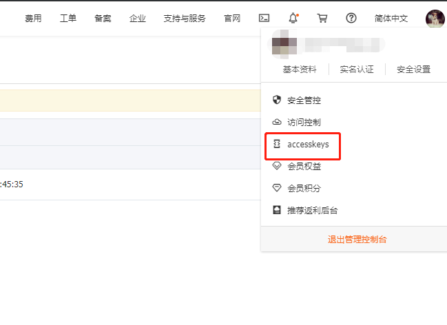
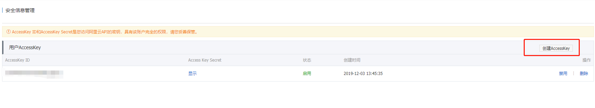

# Python实现阿里云域名DDNS支持ipv4和ipv6

感谢两位大神：
1. https://github.com/dingguotu/ddns-aliyu.git
2. https://github.com/zeruns/-Python-aliddns_ipv4-ipv6


需要安装的库：
```
pip install aliyun-python-sdk-core-v3
pip install aliyun-python-sdk-domain
pip install aliyun-python-sdk-alidns
pip install requests
```

## 关键词

1. domain  域名
2. sub_domain  二级域名，子域名

## 前置条件

1. Git
2. python 3.5
3. 阿里云账号

## 使用方法

---

通过本命令获取 Python-aliddns

```bash
git clone https://github.com/SmartIotMaker/Python-aliddns.git
```

---

接下来到阿里云中创建AccessKey，具体步骤是：
登录阿里云 -> 进入控制台 -> 点击accesskeys 

-> 创建AccessKey 

---

如果域名是在腾讯云或其他非阿里云处购买的，还需要进入相对应的服务商控制台，修改域名的DNS地址为：

```bash
ns1.alidns.com
ns2.alidns.com
```

---

复制 `conf.sample.json` 文件，并重命名为 `conf.json`，根据您的DNSPod设置修改 `conf.json` 文件，填入以下内容：

```bash
{
    "access_key": <access_key>,
    "access_secret": <access_secret>,
    "domains": [
        {
            "name": <first_domain>,
            "sub_domains": [<first_sub_domain_name>, <second_sub_domain_name>,...]
        },
        {
            "name": <second_domain>,
            "sub_domains": [<first_sub_domain_name>, <second_sub_domain_name>,...]
        }
    ]
}
```

`domains`部分，想绑定几个就写几个，不需要多写，`sub_domains`通常写 `@` 和 `*` 就够了，二级子域名直接用 `*` 代替，然后在自己的代理服务器（IIS，nginx，Apache等）上面去进行绑定。domain 和 sub_domain 可以不需要事先手动绑定，本程序会自动识别

---

## 开机启动
1. 拷贝`ddns_aliyun.service` 到树莓派的`/usr/lib/systemd/system/ddns_aliyun.service`
2. 运行`sudo systemctl enable ddns_aliyun` 设置开机启动服务
3. 运行`sudo systemctl start ddns_aliyun` 运行服务

说明：autorun.sh脚本每1小时更新一次

